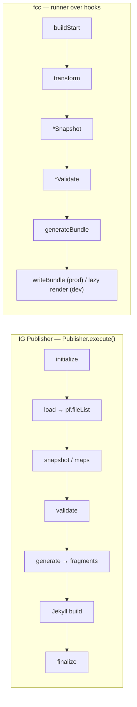

# fcc vs HL7 IG Publisher — architecture diff

A deep architectural comparison between **fcc** (this repo — procedural TypeScript
on Bun) and the **HL7 FHIR IG Publisher** (`org.hl7.fhir.publisher`, Java; vendored
at `vendor/fhir-ig-publisher/`). Grounded in both codebases: IGP claims cite the
actual classes/methods in `org.hl7.fhir.igtools.*`; fcc claims cite `src/` and
[`architecture.md`](architecture.md) / [`modules.md`](modules.md).

The two tools solve the same problem — *take IG source artifacts (FHIR resources,
FSH, markdown, a menu) and produce a FHIR npm package + a browsable spec site with
QA* — but make almost opposite architectural bets. IGP optimizes for **canonical
correctness and one-shot determinism** (it *is* the reference implementation every
HL7 IG is published with). fcc optimizes for **incrementality, dev DX, and
composability**, and deliberately reuses IGP's *output contracts* (npm layout,
`.index.db`, page numbering, qa report) while replacing its *engine*.

## TL;DR — the bets

| Axis | IG Publisher | fcc |
|---|---|---|
| Language / runtime | Java (Maven), one fat JAR over `org.hl7.fhir.core` | TypeScript on Bun, one flat `src/` package |
| Orchestration | monolithic sequential `Publisher.execute()` | engine runner over a persistent `BuildState`; plugins = step descriptors on lifecycle hooks |
| "The world" | `PublisherFields pf` + `SimpleWorkerContext` (canonical-URL keyed, **R5-normalized**) | one `ctx` (`PluginContext`): `resources` + typed `byType.<RT>`/`canonicals.<RT>` + `issues` + `shared` + `sql()` |
| Source→resource | `FetchedFile` → `FetchedResource` (dual Element + Resource model) | a **fold of partial loads** — `Part[]` merged by `id` (several files → one resource) |
| Incrementality | **none** — every change → full rebuild, fresh context | **dependency-graph closure** — only the changed transitive closure re-runs |
| Rendering | **two-stage**: render HTML *fragments* → shell out to **Jekyll** to assemble templated pages | **one route table**, single renderer, two deliveries (prod precompute / dev lazy+SSE) |
| Templates | HL7 **template npm packages** (Liquid + Ant + `_includes`), Jekyll-driven | TS renderer namespaces + `$`-dispatch files; **no Jekyll, no template packages** |
| Extensibility | config + templates; thin `IPublisherModule` hook; compile-time for logic | composition: Loaders / step-descriptor Plugins / Validators / renderer namespaces |
| Dependencies | load every dep package, **convert R2–R5→R5** in memory; `SpecMapManager` URL→web-path | local canonicals; deps used for snapshot base + schema; **no cross-IG link resolution yet** |
| Terminology | **remote** `tx.fhir.org` (`TerminologyClientManager`) | **local only** (gap) |
| Validation | full `org.hl7.fhir.validation.InstanceValidator` (structural + invariants + bindings) | composed: `structural` + `fhirschema` + `fhirpathConstraints` (no tx bindings) |
| Config | `ig.ini` + `ImplementationGuide` resource (+ `sushi-config.yaml`) + template `config.json` | `fcc.config.ts` (`defineConfig`); the IG resource is *synthesized* by `ig-resource` |
| External processes | SUSHI (Node) + Jekyll (Ruby) | SUSHI in a persistent Bun **Worker**; no Ruby |

## 1. Macro orchestration

**IGP — one big sequential method.** A build is `Publisher.execute()` (`publisher/
Publisher.java`), which in watch mode loops but each iteration is a **full
rebuild**: `loader.initialize()` → `loader.load()` (`PublisherIGLoader`, scans
inputs into `pf.fileList`) → `processor.loadConformance2()` + `checkLanguage()`
(snapshots, maps) → `processor.validate()` → `generator.generate()`
(`PublisherGenerator`) → finalize. There is no orchestration *object* — the
pipeline is implicit in sequential calls inside `createIg()`, and all stages share
one mutable holder, `PublisherFields pf`. Coupling is the design: loader,
processor, generator and renderers all read/write `pf` so canonical URLs,
validation results and spec maps stay globally consistent.

**fcc — a runner + lifecycle hooks.** The engine (`src/engine/runner.ts`) exposes
`build()`, `runBuild(state)`, and `runIncremental(state, changedFiles)` over a
`BuildState` that **survives rebuilds**. A plugin is one or more **step
descriptors** `{ hook, fn, ...config }`; `collectHooks` flattens them into
per-stage slots and the runner calls `fn(ctx, config, opts)` at each hook in config
order. Stages: `buildStart transform before/afterSnapshot before/afterValidate
generateBundle writeBundle buildEnd closeBundle` (+ dev-only `handleHotUpdate`,
`watchPaths`). So the pipeline is **data you compose**, not a hard-coded call
sequence — and order = config order.

## 2. The "world" — data model

**IGP** wraps each source file as a `FetchedFile` (`byte[] source`, hash,
`List<FetchedResource>`) and each parsed resource as a `FetchedResource` carrying
**both** the typed `Resource` object model *and* the generic `Element` model. The
authoritative resolution hub is `IWorkerContext`/`SimpleWorkerContext`: resources
are `cacheResourceFromPackage(...)`'d into it and fetched **by canonical URL**
(`context.fetchResource(StructureDefinition.class, url)`). Crucially, dependency
resources of any FHIR version are **converted to R5 in memory** so one context can
hold a mixed-version world (see §6).

**fcc** has one `ctx` (the engine `PluginContext`, [`architecture.md` §2](architecture.md)).
Beyond the `resources` map it maintains **typed, derived indexes** kept in sync on
every add/drop — `ctx.canonicals.<RT>` (url→resource), `ctx.byType.<RT>`
(instances), `ctx.issues` (id→issues), `ctx.shared.<ns>` (cross-plugin handoffs),
and an ad-hoc `ctx.sql(query)` over a lazily-built in-memory SQLite mirror. fcc has
no dual Element/Resource model — a resource is plain `data` (the JSON).

The deeper divergence is *how files become resources*. IGP is 1 file → 1
`FetchedResource`. fcc resources are a **fold of partial loads**
([`architecture.md` §2b](architecture.md)): a loader yields `Partial<Resource>`
parts keyed by `source`, and parts sharing an `id` **merge** — so a profile page
can be assembled from its `.fsh` + `-intro.md` + `-notes.md` with no special
loader, and re-loading one file just replaces its part.

## 3. Incrementality — the sharpest difference

**IGP: none.** `FileChangeMonitor` (polling on macOS, `WatchService` elsewhere)
only answers "did anything change?"; on a hit, `execute()` allocates a fresh
`PublisherFields` and rebuilds **everything** from scratch into a new
`SimpleWorkerContext`. There is no resource dependency graph, no change-set, no
snapshot cache. This is fine for CI publication (one shot) but is why local IGP
edit→preview loops are slow (tens of seconds to minutes).

**fcc: one dependency graph, one closure rule** ([`architecture.md` §4](architecture.md)).
Every node has provenance (files/nodes it derives from) and dependents (who reads
it). A changed file seeds a set via `fileToResources`; `transitiveDependents` over
`reverseCanonical` computes the invalidation closure; only that closure is dropped,
re-loaded, re-transformed (snapshots regenerate along `baseDefinition` edges) and
re-validated. Generators emit only the closure (prod) or nothing (dev, lazy). This
is the bet that makes `fcc dev` rebuilds ~100 ms.

## 4. Rendering & delivery

**IGP — fragments + Jekyll (two stages, external Ruby).** Per-resource renderers
(`renderers/StructureDefinitionRenderer`, `ValueSetRenderer`, … extending
`CanonicalRenderer`/`BaseRenderer`) produce XHTML **fragments** written to
`tempDir/_includes/*.xhtml` via `PublisherGenerator.fragment()` (wrapped in
`…` so Jekyll won't re-interpret them). Page wrappers with
YAML front-matter containing `` are emitted, the TOC is a
`_includes/toc.xml` fragment (`createToc`/`addPageData`), and then IGP **shells out
to Jekyll** (`runJekyll()` → `jekyll build --destination output/`). Layout, nav and
styling come from HL7 **template npm packages** (`templates/TemplateManager`,
`Template`; Liquid via `IGPublisherLiquidTemplateServices`, optional Ant targets
`onJekyll`/`onGenerate`). So look-and-feel is swappable by changing the template
package — at the cost of a Ruby/Jekyll dependency and a two-stage build.

**fcc — one route table, two deliveries (no Jekyll).** `site_core/buildRoutes`
enumerates every output path as a *lazy* `render()` thunk. `fcc build` walks it and
writes `dist/`; `fcc dev` renders one route per request from `ctx` and pushes SSE
live-reload — **same renderer, so no dev/prod drift**. Chrome/layout/nav are TS
functions (`layout`, `sidebar`, `topBar`, `renderNavTree`, …), and page hierarchy
numbering is computed in-process (`pageTree` + `numberPages`, the same
`createTocPage` dotted-DFS algorithm IGP runs — see [`page.md`](page.md)) rather
than emitted as a Jekyll include. Extension is by dropping `$`-files (`$section_`,
`$tab_`, `$block_`, `$page_`, `$route_`) resolved by globally-unique name. There is
no template-package indirection: theming means editing the renderer.

## 5. Extensibility model

**IGP is monolithic + config-driven.** You extend it by: (a) the
`ImplementationGuide` resource + `ig.ini` (paths, tx server, the module code);
(b) **template packages** (Liquid/Ant/`_includes`) for look-and-feel; (c) a thin
`IPublisherModule` interface (`preProcess`, `fetchCanonicalResource`,
`approveFragment`, `isNoNarrative`, …) — the only shipped impl is
`CrossVersionModule`; (d) realm business rules (`USRealmBusinessRules`). New
*engine* logic means editing the Java.

**fcc is composition over configuration.** Four orthogonal extension points, all
`fn(ctx, …)`: a **Loader** (`{extensions, load, invalidate?}`, new file type), a
**Plugin** (a step descriptor `{hook, fn, ...config}`), a **Validator** (composed
into `validator({validators:[…]})`), or a **renderer namespace / `$`-dispatch
file**. Plugins never import each other — they meet only at `ctx.shared.<ns>`.
"Many-variant concern" = a list you compose, not flags.

## 6. Dependencies, versions, terminology, validation

- **Dependency loading.** IGP's `PublisherLoader` loads every `dependsOn` package
  from the cache and **normalizes R2/R3/R4/R4B → R5** via `*ToR5Loader`s, tagging
  them `RESOURCE_INTERNAL_USE_ONLY`; `SpecMapManager` reads each package's
  `spec.internals` to resolve canonical URL → web path (so cross-IG links work).
  fcc loads deps only for the **snapshot base index** and `fhirschema` validation
  (`packagesDir`); it does **not** normalize versions and does **not** yet resolve
  cross-IG/base-spec links — the #1 item in [`ig-publisher-parity.md`](ig-publisher-parity.md).
- **Terminology.** IGP is **remote-first**: `context.connectToTSServer(... tx.fhir.org)`
  and `TerminologyClientManager` expand ValueSets / validate codes on demand,
  reported in `qa-txservers.html`. fcc has **no tx client** — terminology is local
  only (a known gap).
- **Validation.** IGP runs the full reference `InstanceValidator`
  (`org.hl7.fhir.validation`) — structure, cardinality, types, FHIRPath invariants,
  **terminology bindings**, reference resolution — in two phases (conformance load,
  then instances), via `ValidationServices`. fcc composes `structural` (lite lint)
  + `schema` (`@atomic-ehr/fhirschema`) + `fhirpathConstraints`
  (`@atomic-ehr/fhirpath`); incremental and local, but **no binding validation**.
- **Both** render a QA page: IGP's `ValidationPresenter` → `qa.html`
  (+ suppressed-messages, eslint/text/OO variants); fcc's `renderErrors` →
  `errors.html` (now with by-message rollup + suppression parity).

## 7. Outputs

IGP emits: the HTML site, the npm `package.tgz`, `spec.internals` (the link map),
`qa.html` + `validation-summary.json`/`validation-oo.json`, `package.db` (SQLite),
plus a whole **publishing layer** (`web/`): `IGRegistryMaintainer`,
`PublicationProcess`, `HistoryGenerator`/`history.html`, publish-box, feeds,
redirects. fcc emits: the site, `package.tgz` (faithful HL7 layout, via the `npm`
plugin), `.index.db` (the `sqlite` plugin, byte-reused by `npm`), `errors.html`,
and `$route_*` exports (e.g. `examples.json.zip`). fcc has **no registry/history/
publish-process** machinery (deliberately out of scope — that's release
orchestration, not building).

## 8. Philosophy

IGP is the **reference implementation**: tight coupling and a single R5-normalized
worker context buy *guaranteed cross-component consistency* and *the* canonical
definition of "correct", at the price of full rebuilds, a Ruby/Jekyll dependency,
and compile-time-only logic extension. It is conservative on purpose — every HL7
IG depends on its output being exactly right.

fcc rebuilds the *engine* on three bets — **(1) one dependency graph** (so dev is
near-free and incremental everywhere), **(2) one renderer, two deliveries** (so
there is no dev/prod drift and no Jekyll), **(3) composition over configuration**
(plugins/loaders/validators/`$`-files as data) — while keeping IGP's **output
contracts** (npm layout, `.index.db`, page numbering, qa semantics) so its packages
and sites drop into the same ecosystem. The trade fcc accepts: it does not yet
match IGP's **validation depth, terminology server, and cross-IG link resolution**
(tracked in [`ig-publisher-parity.md`](ig-publisher-parity.md), top items #1–#4).

## 9. Where each wins

**IGP ahead:** full reference validation + terminology bindings; cross-version
(R2–R5) normalization; cross-IG/base-spec link resolution (`SpecMapManager`);
publishing lifecycle (registry, history, publish-box); swappable HL7 templates;
battle-tested on every published IG.

**fcc ahead:** sub-second incremental dev rebuilds (dependency-graph closure);
single renderer with zero dev/prod drift + SSE live-reload + a live REPL over the
build; no external Ruby/Jekyll; composable, inspectable plugin model
(`fn(ctx,config,opts)`, config-as-data); partial-load merge (multi-file → one
resource); ad-hoc `ctx.sql()` over the graph. Verified IG-agnostic on two IGs
(us-core + mCODE, [`examples/`](../examples)).
