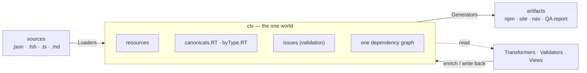
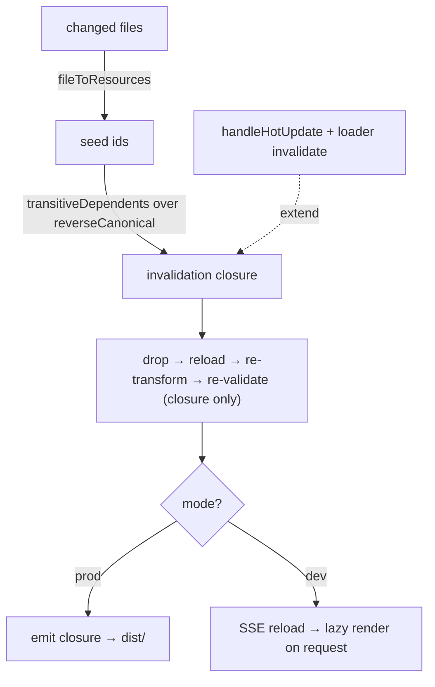
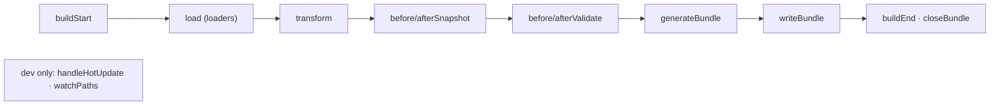
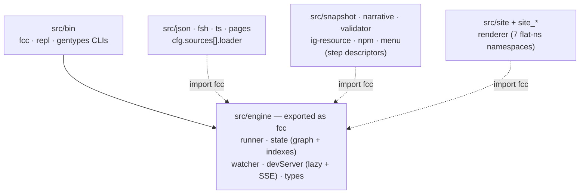

# fcc — architecture

How fcc turns IG source artifacts into FHIR packages + browsable sites, and how
it rebuilds **incrementally**. This document describes the **target** architecture
we are refactoring toward; a Status table (§10) marks what is done, in progress,
or planned, and §11 is the refactoring plan.

## 0. The model in one breath

Everything flows through a single in-memory world, `ctx`. Sources are loaded into
it, enriched in place, projected out of it:



Five ideas carry it — each the *simple* answer to one concern, together the
*flexible* whole:

- **Everything is a resource.** Source files — FHIR resources, **markdown pages**,
  examples, the menu — are all loaded into one resource graph in `ctx`. One graph,
  one provenance map, one incremental algorithm. Non-FHIR resource types (`Page`,
  …) are simply filtered out of FHIR-facing consumers.
- **`ctx` is the world.** Resources, typed canonical indexes, validation results,
  computed navigation — all live in `ctx`. Producers read `ctx` and write back
  into `ctx`; nothing passes data sideways.
- **One renderer, two deliveries.** A single route table renders any page; prod
  precomputes to `dist/`, dev renders on demand from `ctx` + SSE live-reload.
- **Plugins are step descriptors** `{ hook, fn, ...config }`; every function is
  `fn(ctx, config, opts)`. They meet only at `ctx`; never import one another.
  Order = config order.
- **Composition over configuration.** Many-variant concerns are lists you compose
  (`validators: [...]`, a target's `pipeline: [...]`), not flags.

## 1. The six layers

Every plugin/function is one of six kinds. The first three *fill/enrich* `ctx`;
the last three *project* `ctx` into artifacts.

| Layer | Role | Pure? | Runs |
|-------|------|-------|------|
| **Loaders** | source file → resource(s) in `ctx` (FHIR, `Page`, menu, examples) | — | on load + on file change |
| **Transformers** | enrich a resource (narrative, snapshot) | *local* pure, or *global* (needs graph) | local: lazy/per-resource · global: after load |
| **Validators** | read `ctx` → write `issues` back into `ctx` | (read-only over graph) | after load, over the changed closure |
| **Views** | project a resource into a representation (snapshot/diff/json tabs, companion files) | pure `(ctx, { resource })` | lazy, at render time |
| **Generators** | assemble a whole artifact from `ctx` (site route table, npm tarball, nav, QA page) | reads `ctx` | per output target |
| **Renderers** | leaf fns composing a page from views + chrome (`$section_*`, `layout`, …) | pure | lazy, at render time |

**Transformer timing** is by *data dependency*, not difficulty:
- *local* (resource → itself, e.g. `narrative`): depends only on the resource —
  can run lazily / per-changed-resource.
- *global* (e.g. `snapshot` needs the base-definition chain; `ig-resource` needs
  all resources): runs after the load phase. "Needs context" ≠ "needs a full
  re-run" — it needs the current full `ctx` (in memory) but only recomputes the
  changed closure (§4).

## 2. `ctx` — the single world

`ctx` (the build `PluginContext`) carries the graph plus typed, derived indexes,
maintained incrementally on every `indexResource`/`dropResource`:

```ts
ctx.resources                          // Map<id, Resource> — the graph
ctx.canonicals.StructureDefinition     // Map<url, Resource> — typed per resourceType
ctx.canonicals.ValueSet                //   (autocomplete; no string queries)
ctx.byType.Patient                     // Resource[] — instances of a type
ctx.byType.Page                        // markdown pages, also resources
ctx.issues                             // Map<resourceId, Issue[]> — validation results
ctx.shared.<ns>                        // cross-plugin handoffs (menu → site, …)
```

There is **one** `ctx` — the engine `PluginContext`; the site/menu flat-ns
plugins attach their `fns` onto it (`Context = PluginContext & { fns: FnsRegistry }`).
`ctx.fns.<ns>.<fn>(ctx, opts)` is the flat-namespace call surface; cross-file
types via `types.<ns>.<Name>`.

## 3. Pipelines: one source → many artifacts

The pipeline splits into a **data pipeline** (shared) and an **output pipeline**
(per target):

- **Data pipeline** — Loaders → Transformers → Validators. Builds the shared
  `ctx`. It is shared across all targets of the *same FHIR version* (snapshots
  and validation are version-specific).
- **Output pipeline** — Generators, chosen *per target*. Each target reads its
  data `ctx` and emits its artifact set.

```ts
targets: [
  { name: "npm",     fhir: "4.0.1", out: "dist/npm", plugins: [npm()] },   // package only
  { name: "site-r4", fhir: "4.0.1", out: "dist/r4",  plugins: igSite() },  // three sites,
  { name: "site-r5", fhir: "5.0.0", out: "dist/r5",  plugins: igSite() },  //  one per version
]
```

"Three sites for three versions" = three data `ctx`s, each with a site generator;
"npm only" = one data `ctx` + the npm generator. **Presets** (`igPublisherPipeline()`)
package the IG-Publisher-equivalent layer list; everything is configured in code.

## 4. Incrementality — one graph, one closure rule

The whole system is **one dependency graph**, and incrementality is a single rule
applied to every layer:

> Every node in `ctx` has *provenance* (the source files / other nodes it derives
> from) and *dependents* (who reads it). A changed source invalidates the
> transitive closure of dependents; only the producers of that closure re-run, in
> layer order.

Concretely, on `state.ts`'s `TargetState` (survives rebuilds):

| Index | Maps | Purpose |
|-------|------|---------|
| `fileToResources` ⇄ `resourceToFiles` | source file ⇄ resource ids | seed the closure from a changed file (any kind — FHIR or `Page`) |
| `reverseCanonical` | canonical url → ids referencing it | the dependency graph |
| `canonicals.<RT>` / `byType.<RT>` | typed indexes | derived; kept in sync on add/drop |

`runIncremental`:
1. **Seed** — changed files → resource ids (`fileToResources`).
2. **Closure** — `transitiveDependents(seed)` over `reverseCanonical`.
3. **`handleHotUpdate`** + **loader `invalidate`** extend it (soft/view edges, FSH whole-tank).
4. **Drop** invalidated; **re-load** their files; re-`populateDeps`.
5. **Re-transform** only the closure; **re-validate** only the closure (replace those `ctx.issues` entries).
6. Generators emit only the closure (prod) — or nothing (dev, lazy).



Per layer:
- **Loaders** — a changed `.md` invalidates exactly its `Page` resource (provenance), not the whole site.
- **Transformers** — *global* ones (snapshot) are covered by the closure: editing profile P invalidates derived profiles via `baseDefinition` edges, so their snapshots regenerate; *local* ones touch only the changed resource.
- **Validators** — re-validate the closure; `ctx.issues` keeps unchanged entries. The QA page reads the whole map → always fresh.
- **Views / Renderers** — pure, memoizable by `(resourceId, cycle)`; lazy in dev.
- **Generators** — *per-resource* (a page per resource): re-emit only changed (route table gated by `changedIds`). *Aggregate* (nav/index/npm/QA): re-run when their input set's closure is non-empty; cheap ones (index/nav) always, expensive ones (npm tarball) gated.

**Why dev is nearly free:** generators are **lazy** — they render from `ctx` on
request. An edit updates the data `ctx` (closure only) and the watcher broadcasts
an SSE reload; the browser re-requests the viewed page, which renders fresh from
the current `ctx`. Aggregate sections (a profile's "Examples", the nav) are
correct automatically because they read `ctx` at render time. Prod (precompute)
is the only place a generator needs to know *what* to re-emit.

## 5. Dev vs prod delivery (one renderer)

The view layer is a single **route table** (`site_core/buildRoutes`) used by both
modes — one renderer, so output is identical:

- it enumerates every output path as a *lazy* render thunk (resource pages,
  companion tabs + raw side-cars, `index`/`artifacts`/`errors`/`style.css`,
  `Page` resources) without rendering;
- `writeBundle` publishes `ctx.shared.site.render(path)` for the dev server, and
  in **prod** writes every route to `dist/` (honoring `changedIds`); in **dev**
  writes nothing.

**Dev server** (`src/engine/devServer.ts`): `Bun.serve` renders each request on
demand from `ctx`, and pushes a live-reload over SSE (`/__fcc/events`) after every
rebuild. `fcc dev` watches `cfg.sources` + `fcc.config.ts` + plugin `watchPaths`.

## 6. Plugins = step descriptors, `fn(ctx, config, opts)`

A plugin is one or more **step descriptors** — `{ hook, fn, ...config }`, the
`fn` plus its config inline, as data. `collectHooks(plugins)` flattens them into
per-stage slots of `{ fn, config }`; the runner runs each slot, in config order,
calling `fn(ctx, config, opts)` at its stage:



Every framework function is `fn(ctx, config, opts)` — `ctx` (the one world),
`config` (the descriptor's static data), `opts` (the per-call payload:
`{ resource }` / `{ bundle }` / `{ hot }` / `{}`). No setup function, no factory
closures: config is inspectable data and plugin state lives in `ctx.shared`. A
factory binds opts → descriptors (`snapshot(opts)` → `[{ hook: "afterValidate",
fn: snapshotFn, ...opts }]`); the config files are unchanged. Loaders are not
steps — they sit on `cfg.sources[].loader` as `{ extensions, load(ctx, { file }),
invalidate? }`. Every fn may be async; the runner awaits all.

## 7. Validation — one plugin, composable validators

One plugin, `fcc/validator`, runs a composed list of async validators and writes
one report into `ctx` (rendered as `errors.html`, à la IG-Publisher `qa.html`):

```ts
validator({ validators: [structural(), schema({ packagesDir }), fhirpathConstraints()] })
```

- `structural()` — lite lint (resourceType/id/url/dupes/refs), no cache.
- `schema()` — `@atomic-ehr/fhirschema`: instances vs profiles + canonicals translate.
- `fhirpathConstraints()` — `@atomic-ehr/fhirpath`: element `constraint[]` invariants (read from snapshots).
- `Validator = (ctx) => Promise<issues>` — async; the plugin runs them in parallel.

## 8. FSH off-thread

`fsh-sushi` compiles the whole FSH tank in one multi-second call with no per-file
source map, so it runs in a persistent **Worker** (`src/fsh/worker.ts`) — the dev
loop stays responsive (<1 ms requests during a ~2 s recompile). `ref` while a
compile is pending, `unref` when idle.

## 9. Engine map



## 10. Status

| Area | State |
|------|-------|
| Dependency-graph incremental (resources) | **done** (`runIncremental` + indexes) |
| Emacs-hook plugins, `(ctx, opts)` everywhere, async-first | **done** |
| One renderer (route table), dev lazy + SSE live-reload | **done** |
| snapshot (`fhirschema`), FSH worker | **done** |
| Validator: `structural` / `schema` / `fhirpathConstraints` → `errors.html` | **done** |
| Typed `ctx.canonicals.<RT>` / `ctx.byType.<RT>` | **done** (Proxies over the graph) |
| Incremental validators (descriptors, gate by `changedIds`); `ctx.issues` map | **done** |
| Everything-is-a-resource: pagecontent pages as `Page` resources via a loader | **done** (intro/notes ⏳) |
| Data pipeline vs per-target output pipeline (`Target.plugins`); `igSite()` preset | **done** |
| Unify the two `ctx` objects (engine + site) into one | **deferred** (§11, mostly aesthetic) |

## 11. Refactoring plan

Ordered by increasing risk; each step ships green (builds + tests) on its own.
**Steps 1–4 are done** (✅); step 5 (and the menu sub-step) is deferred (⏳).

1. **Typed indexes.** Add `ctx.canonicals.<RT>` (Map<url,Resource>) and
   `ctx.byType.<RT>` (Resource[]); maintain them in `indexResource`/`dropResource`.
   Migrate `byUrl`/`query` call sites opportunistically. *Low risk; immediate DX +
   foundation for views/validators.*
2. **Incremental validators.** Move results to `ctx.issues: Map<id, Issue[]>`; gate
   each validator by `changedIds` (re-validate only the closure, merge). QA page
   reads the whole map. *Uses the existing graph.*
3. **Pages as resources.** A `pages()` loader turns pagecontent/landing/intro-notes
   `.md` into `Page` resources. Filter `Page` out of FHIR consumers (npm,
   ig-resource, validator, snapshot, narrative, artifacts). `buildRoutes` reads
   `ctx.byType.Page`; pagecontent dir becomes a source (auto-watched). Soft edge
   intro/notes-`Page` → target resource page via `handleHotUpdate`. *Better
   incrementality; the "everything is a resource" core.*
   ✅ Done (steps 1–3). Intro/notes stay on the site's `loadIntroNotes` path for
   now (⏳ a small follow-up — convert them to `Page` resources too).
4. **Data vs output pipeline.** ✅ Done. `Target.plugins?` (output generators) run
   per target in addition to the shared `cfg.plugins` (data); hooks collected per
   target; `fcc/presets` → `igSite()`. Enables "npm-only" / "3 sites". *(Menu as a
   resource and a shared-data-`ctx` across same-version targets remain ⏳.)*
5. **Unify `ctx`.** ✅ Done. One `ctx` (the engine `PluginContext`); the site/menu
   flat-ns plugins attach `fns` + `state` onto it. Ambient `Context =
   types.fcc.PluginContext & { fns: FnsRegistry }`; `ctx.cfg`→`ctx.config`,
   `ctx.bundle.resources`→`ctx.resources` reconciled across the site layer.
6. **Descriptors for all plugins.** ✅ Done. The `{ fn, ...config }` +
   `fn(ctx, config, opts)` model now covers every plugin (steps `{ hook, fn,
   ...config }`), not just validators — config is inspectable data everywhere, no
   setup functions, plugin state in `ctx.shared`.
